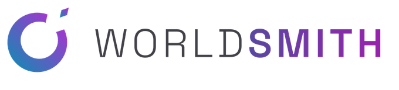
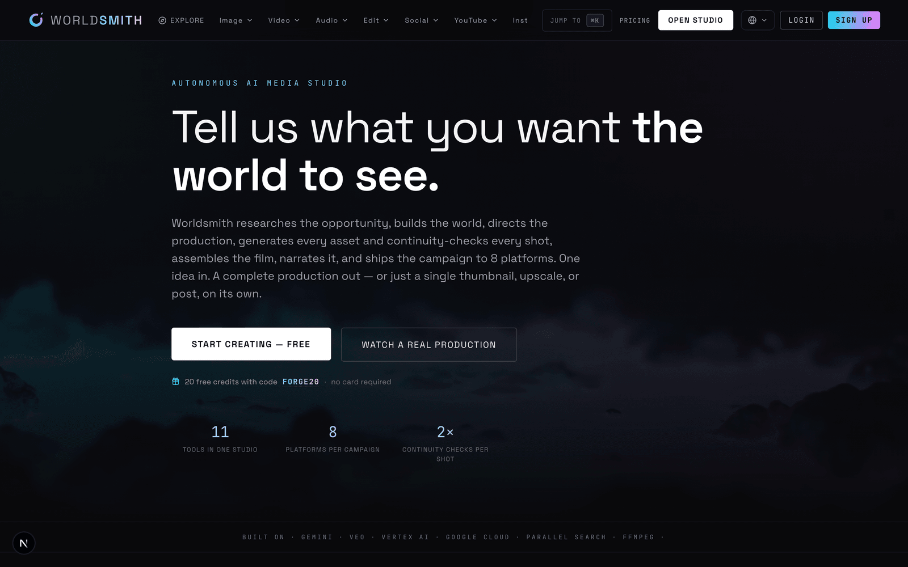
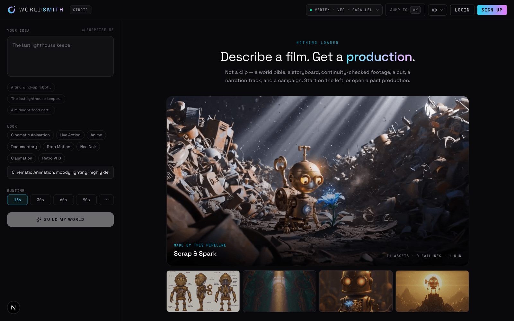
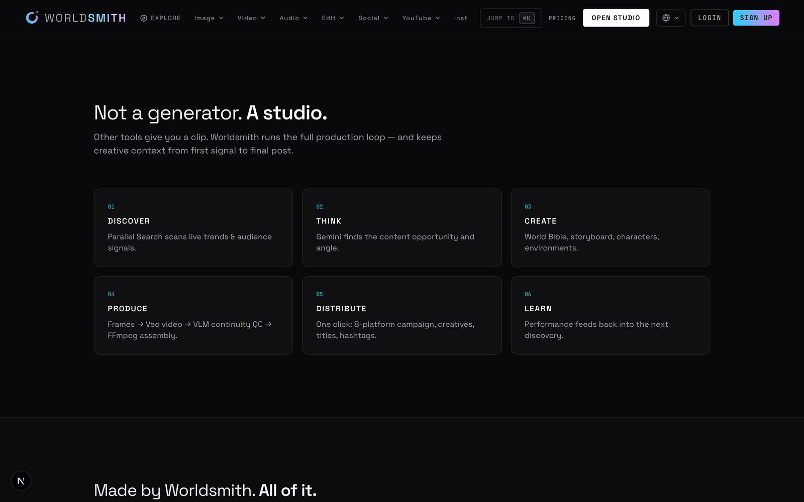
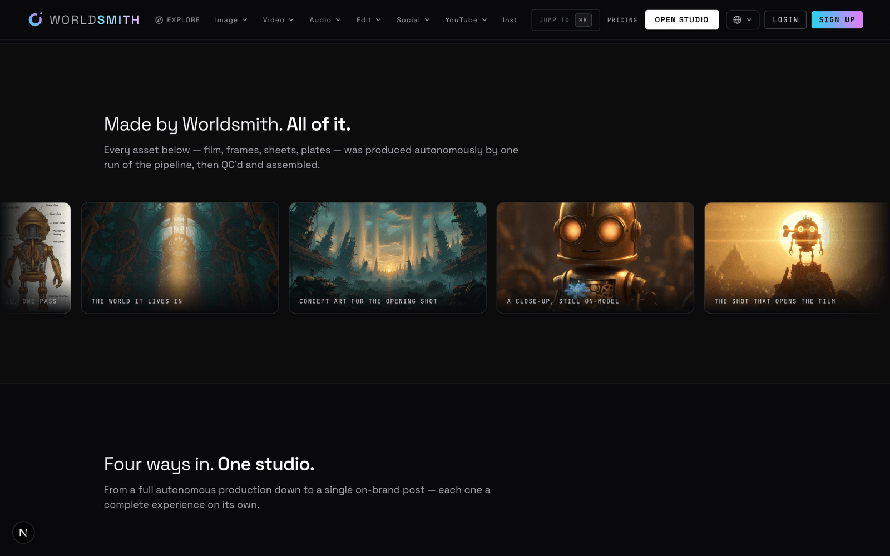
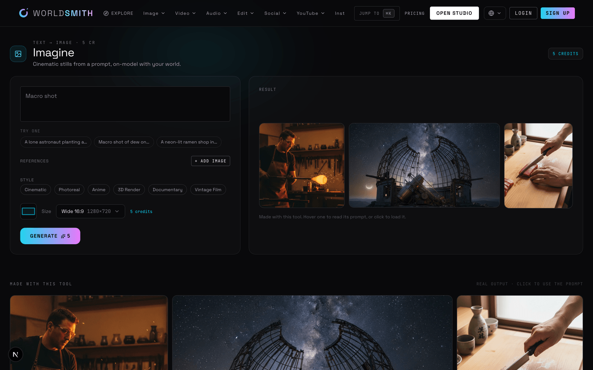
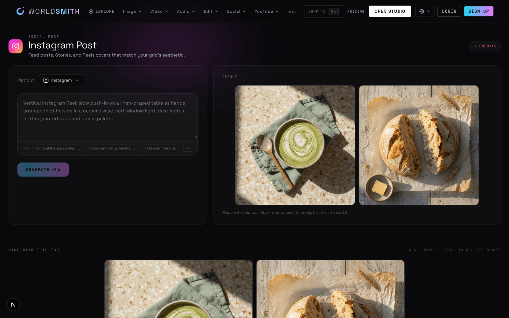
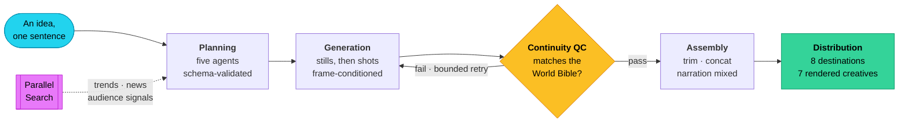

<div align="center">

<picture>
  <source media="(prefers-color-scheme: dark)" srcset="docs/brand/wordmark-dark.png">
  
</picture>

**An autonomous media production studio. One idea in — a complete, distribution-ready production out.**

*Google Cloud Agentic Cinema Hackathon — **Parallel** track*

[Live demo](https://worldsmith.vercel.app) · [Demo video](https://youtu.be/T9oYveaXwC4) · [Architecture](#architecture)

</div>

---

## For judges — run a full production free

A complete 15-second production costs ~1,047 credits (three Veo clips, the stills behind them,
narration, and eight campaign creatives). New accounts start with 15, which is enough to try the
standalone tools but not the flagship pipeline. So there is a code for it:

| | |
|---|---|
| **Code** | `JUDGE2026` |
| **Grants** | 1,200 credits — one full 15-second production, with room for a retry |
| **Where** | Sign in, then **Account → Redeem a code** (or the *Redeem* field on the pricing panel) |

Then open **[/studio](https://worldsmith.vercel.app/studio)**, type an idea, and press **Build my
world**. Research runs first — the **Research Signals** panel shows the live Parallel results and
the `search_id` behind them before any frame exists.

**Verify the stack without an account:** [`/api/health`](https://worldsmith.vercel.app/api/health)
reports the resolved providers and the deployed commit. All of `RESEARCH_PROVIDER`,
`IMAGE_PROVIDER` and the rest should read live services, never `mock`.

## The problem

Every AI video tool gives you a clip. None of them give you a *production*.

A real studio doesn't start with a prompt — it starts with research: what does the audience actually want right now? Then it builds a world, keeps every character on-model across every shot, quality-checks the footage, assembles it, narrates it, and ships a campaign to eight platforms.

That whole loop is the bottleneck. Worldsmith automates it end to end, and keeps creative context intact from the first market signal to the final post.

## What it does

Give it one sentence. A network of agents then:

| # | Stage | What happens |
|---|-------|--------------|
| 1 | **Discover** | **Parallel Search** scans live web signals for a real content opportunity |
| 2 | **Think** | Gemini turns those signals into a content angle and creative strategy |
| 3 | **Create** | Builds a persistent **World Bible** — characters, locations, visual rules |
| 4 | **Produce** | Generates frames → Veo video → **VLM continuity QC** → FFmpeg assembly |
| 5 | **Distribute** | One click: 8-platform campaign with on-model creatives and copy |
| 6 | **Learn** | Performance signals feed the next discovery cycle |

Expensive steps sit behind human approval gates, and every asset is costed in a transparent per-asset ledger.

Beyond the full pipeline, **11 standalone tools** work on their own — Text→Image, Text→Video, Image→Video, Voiceover+Images→Video, Text→Speech, Image→Prompt, Upscale, Social Post, YouTube Kit, Creative Text Editor, and **Cast** (build a character once, reuse it in any scene).

## Partner track: Parallel

**Parallel Search is the first act of the pipeline**, not a bolt-on. Worldsmith's core claim — *"not a generator, a studio"* — depends on researching a real opportunity before a single frame is drawn. That research step is Parallel.

- **The call:** [`parallel-research-provider.ts:57`](src/providers/parallel-research-provider.ts#L57) — `POST /v1/search` against [`https://api.parallel.ai`](src/providers/parallel-research-provider.ts#L57), authenticated with `x-api-key`, at runtime
- **Wired in:** [`research-factory.ts:8`](src/providers/research-factory.ts#L8) — selected whenever `RESEARCH_PROVIDER` is not `mock` and a key is present
- **Invoked by the pipeline:** [`orchestrator.ts:152`](src/core/orchestrator.ts#L152) — the first stage of every production, before any frame is drawn
- **Steered by the run, not by a constant:** every run's `objective` is built from the user's own goal ([`research-agent.ts:41`](src/agents/research-agent.ts#L41)) and all planned queries go out in one batched `search_queries` call — so two different ideas genuinely research two different things
- **Proof at runtime:** the Studio's **Research Signals** panel renders each result's retrieved excerpt beside its source link, and prints Parallel's own `search_id` for the run — the evidence is traceable back to the exact upstream call. The header badge reads `RESEARCH · PARALLEL` straight from resolved config.

Every claim the research report makes is filtered back against the retrieved evidence
([`research-agent.ts:69`](src/agents/research-agent.ts#L69)): a source the model did not actually
receive is dropped rather than displayed. Evidence text is fenced and marked untrusted in the
synthesis prompt, so a page that tries to give the agent instructions is treated as data.

## Google Cloud

Every model in the system is a Google model. There are no third-party AI providers — [`src/providers/factory.ts`](src/providers/factory.ts) resolves to Gemini, Gemini on Vertex AI, or an offline mock, and nothing else.

| Capability | Service | Imported and called at |
|---|---|---|
| Reasoning / agents | Gemini on **Vertex AI** | [`vertex-provider.ts:49`](src/providers/vertex-provider.ts#L49) |
| Image generation | **Vertex AI** — `gemini-2.5-flash-image` | [`vertex-image-provider.ts:37`](src/providers/vertex-image-provider.ts#L37) |
| Video generation | **Veo 3.1** | [`veo-video-provider.ts:44`](src/providers/veo-video-provider.ts#L44) |
| Continuity QC | Gemini **VLM** | [`gemini-vlm-provider.ts:30`](src/providers/gemini-vlm-provider.ts#L30) |
| Narration | Gemini **TTS** | [`gemini-tts-provider.ts:80`](src/providers/gemini-tts-provider.ts#L80) |
| Campaign copy | Gemini | [`gemini-distribution-provider.ts:65`](src/providers/gemini-distribution-provider.ts#L65) |
| Auth + data | **Firebase** Auth / Firestore | [`admin-firestore-store.ts:37`](src/store/admin-firestore-store.ts#L37) |

All six model providers construct their client as `new GoogleGenAI({ vertexai: true, project, location })`
— Vertex AI proper, not the consumer Gemini API — and call `models.generateContent` or
`models.generateVideos` on it. SDKs: `@google/genai`, `@google/generative-ai`, `firebase`,
`firebase-admin`.

**Verify it in one command**, without a key or an account:

```bash
grep -rn "vertexai: true" src/providers/     # every Vertex client construction
grep -rn "parallel.ai\|v1/search" src/providers/      # the Parallel Search call
```


### On Agent Builder

The agent network runs on **Vertex AI — which Google now calls Agent Platform** — driven through
the `@google/genai` SDK, with orchestration, schema-validated handoffs, the QC gate and the cost
ledger implemented directly in [`src/core/orchestrator.ts`](src/core/orchestrator.ts) rather than
delegated to the ADK runtime.

That is not a framing; it is what the platform calls itself. Every model call in this system
authenticates to `aiplatform.googleapis.com` under the role Google titles **Agent Platform User** —
verifiable without an account or a key:

```bash
gcloud iam roles describe roles/aiplatform.user | grep -E "^title|^name"
# name: roles/aiplatform.user
# title: Agent Platform User
```

That was a deliberate call, and it is worth being straight about. Three of this pipeline's
properties are things a generic agent runtime does not give you: shot durations are reconciled
*deterministically* against the requested runtime rather than trusted to a model's arithmetic;
continuity QC is a **gate** that can send a shot back, not a report appended after the fact; and
credits are **reserved before** a provider is called and refunded when it produces nothing. Each
one needs control over the loop between agent steps. Every model call underneath is still Gemini
on Vertex AI, and nothing else.

## Screenshots

| | |
|---|---|
|  **Landing** |  **Studio — the production console** |
|  **The loop — Parallel signals through to distribution** |  **Every asset, autonomously produced** |
|  **Text → Image** |  **Social posts, in native platform sizes** |

## Demo video

**[Watch the 3-minute demo →](https://youtu.be/T9oYveaXwC4)**

One sentence in, a finished production out — live Parallel research, the World Bible, Veo footage
with continuity QC, the cut, and the campaign.

## Architecture

One idea enters. Five planning agents turn it into a production bible, a generation
loop builds every asset and checks its own work, and a campaign leaves for eight
destinations. No human step in between.



### The five planning agents

Each one hands the next a validated object, not a blob of prose — so a later stage
can rely on the shape of what it receives.

| Agent | Produces |
|---|---|
| `research-agent` | Evidence gathered through **Parallel Search**, carrying its sources |
| `opportunity-agent` | The angle actually worth making, argued from that evidence |
| `world-builder-agent` | The World Bible — characters, locations, props, visual language |
| `storyboard-agent` | Shots, with durations reconciled to the runtime you asked for |
| `production-planner-agent` | Per-asset model and cost plan, before a cent is spent |

### QC is a gate, not a report

The difference between a demo and a system is what happens when a model gets it
wrong. Every generated shot goes back to a vision model with the World Bible and
is asked whether the character, location and look actually match. A pass moves
forward; a fail regenerates that shot against the same reference, bounded so a
stubborn shot can't burn the budget. Continuity is enforced rather than hoped for.

### Every provider is a seam

| Seam | Real | Offline |
|---|---|---|
| LLM | Gemini on Vertex AI | `mock` |
| Image | `gemini-2.5-flash-image` | `mock` |
| Video | Veo 3.1 | `mock` |
| Vision QC | Gemini VLM | `mock` |
| Speech | Gemini TTS | `mock` |
| Research | **Parallel Search** | `mock` |
| Distribution | Gemini | `mock` |

Each sits behind an interface chosen by one environment variable, so the entire
pipeline — planning, generation, QC, assembly, campaign — runs end to end with
zero API spend. That is how this was developed, and how you can run it now.

### Decisions worth pointing at

| | |
|---|---|
| **Credits are reserved, not billed** | A shortfall stops the run *before* a provider is called, and anything that produces nothing is refunded. No free generation, no charging for failures. |
| **Assets get stable references** | Signed URLs expire; a 7-day URL persisted into a database is a 404 with a delay fuse. Assets resolve through a route that reads local disk or cloud storage. |
| **Uploads bypass the server-action boundary** | Data URLs above a few hundred KB blow the framework's argument limit, which silently broke every image-taking tool for real photographs. References upload as multipart and travel as ids. |
| **Concurrent writes are serialized** | The cost ledger and generation status are read-modify-write; retrying an asset mid-run would otherwise clobber the run's own accounting. |

### Where things live

| Path | Role |
|---|---|
| `src/agents/` | The five planning agents |
| `src/core/` | Orchestrator, asset director, QC director, assembler, creative director, credits, TextKit |
| `src/providers/` | Every provider seam, real and mock |
| `src/store/` | Firestore and local project/asset stores, per-project locking |
| `src/app/studio/` | The autonomous pipeline UI |
| `src/app/tools/` | The 11 standalone tools |

## Run it locally

**Prerequisites:** Node 22.12+, a Google Cloud project with Vertex AI enabled, a Firebase project, and a Parallel API key.

> Node 22.12 is a hard floor, not a preference. `firebase-admin` reaches `jwks-rsa`, which
> `require()`s `jose` — an ESM-only package. Older Node throws `ERR_REQUIRE_ESM` and every
> call touching Auth or Firestore fails, while the app otherwise appears to start normally.

```bash
git clone https://github.com/TusharTechs/worldsmith.git && cd worldsmith
npm install
cp .env.example .env.local   # then fill in the values below
npm run dev                  # http://localhost:3000
```

Required environment:

```bash
# Google Cloud / Vertex AI
VERTEX_PROJECT_ID=your-gcp-project
VERTEX_LOCATION=us-central1
VERTEX_SERVICE_ACCOUNT_PATH=./firebase-service-account.json

# Deploying to a serverless host instead? There is no file to point at, so paste
# the same service-account JSON into VERTEX_SERVICE_ACCOUNT_JSON and omit the path.

# Providers — all Google, or "mock" to run fully offline
LLM_PROVIDER=vertex
IMAGE_PROVIDER=vertex
VIDEO_PROVIDER=vertex
VLM_PROVIDER=vertex
AUDIO_PROVIDER=vertex
DISTRIBUTION_PROVIDER=vertex

# Partner track
RESEARCH_PROVIDER=parallel
PARALLEL_API_KEY=your-parallel-key

# Firebase (client)
NEXT_PUBLIC_FIREBASE_API_KEY=...
NEXT_PUBLIC_FIREBASE_AUTH_DOMAIN=...
NEXT_PUBLIC_FIREBASE_PROJECT_ID=...
NEXT_PUBLIC_FIREBASE_STORAGE_BUCKET=...
NEXT_PUBLIC_FIREBASE_MESSAGING_SENDER_ID=...
NEXT_PUBLIC_FIREBASE_APP_ID=...

# Absolute origin. Asset URIs are resolved against this server-side, so
# leaving it unset makes generated images and video fail to load.
NEXT_PUBLIC_APP_URL=http://localhost:3000

# Owner-only admin (promo codes)
OWNER_EMAIL=you@example.com
```

Set every `*_PROVIDER` to `mock` to explore the full flow without spending anything.

**Verify the config:** open `/studio` — the badge row shows each resolved provider. All should read `VERTEX` / `VEO` / `PARALLEL`, with none on `MOCK`.

## Screenshot guide

The screenshots above regenerate from a locally running instance:

```bash
npm run dev
node docs/capture-screenshots.mjs
```

Targets live in `docs/screenshots.json`. Shots are taken signed-out, so no account
data ends up in the repo — which also means the Studio interior (a completed
timeline, the Research Signals panel with its citations, the distribution tabs)
is not covered. Capture those by hand from a signed-in session if you want them.

## Tech

Next.js 16 (App Router, Turbopack) · React 19 · TypeScript (strict) · Tailwind CSS v4 · Firebase · FFmpeg · Dodo Payments · i18n in 9 languages

## License

[Apache License 2.0](LICENSE) — free to use, modify and distribute, including
commercially, with an explicit patent grant.
